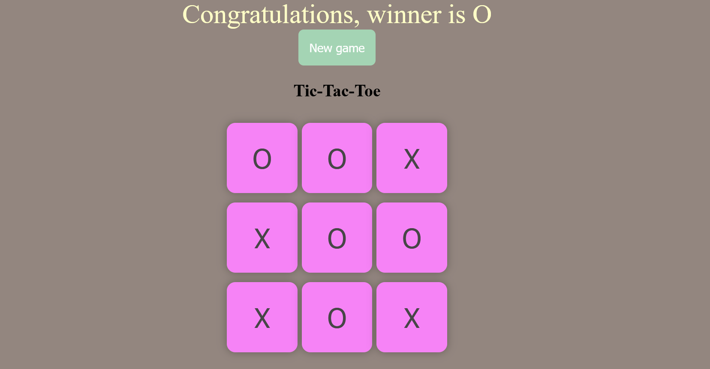

# Tic-Tac-Toe Game

## Description
This Tic-Tac-Toe project is a simple yet interactive game built using [your chosen technology]. It features a clean UI and game logic that allows two players to compete in a classic 3x3 grid. The game includes a turn-based system, win detection, and a restart option.

## Features
- Two-player mode
- Win detection with victory message
- Draw detection
- Restart game functionality
- Simple and intuitive UI

## Technologies Used
- [List the technologies used, e.g., HTML, CSS, JavaScript]
- [Any libraries or frameworks, if applicable]

## Installation
1. Clone the repository:
   ```sh
   git clone https://github.com/rahular777/tic-tac-toe.git
   ```
2. Navigate to the project directory:
   ```sh
   cd tic-tac-toe
   ```
3. Open `index.html` in a browser (if using HTML/CSS/JS) or run the appropriate command if using a framework.

## Usage
1. Open the game.
2. Players take turns clicking on a grid cell.
3. The game announces the winner or a draw when conditions are met.
4. Click the restart button to play again.

## Images
()

